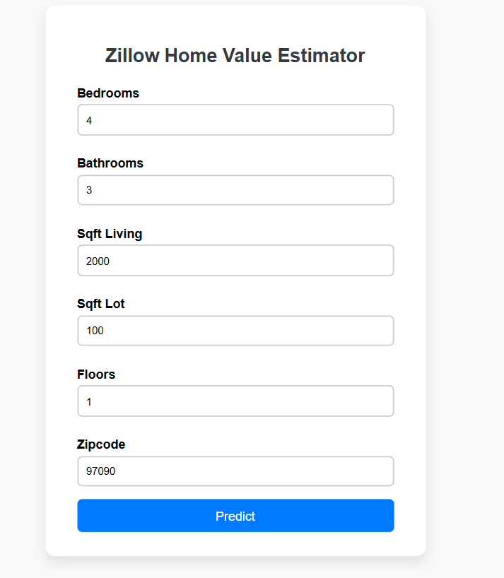

# 🏠 Zillow Home Value Estimator

A Flask web application that predicts estimated home values using a machine learning regression model trained on real Zillow property data.

---

## 📌 Project Overview

This project allows users to enter basic home features such as number of bedrooms, bathrooms, square footage, and zipcode, and get a predicted home value based on a trained ML model.

Built with:
- **Python**
- **Flask**
- **scikit-learn**
- **Pandas**
- **Joblib**

---

## 📈 Features

- 🔢 Input form for key property details
- 🤖 Machine Learning model (Linear Regression or custom model)
- 🧠 Full preprocessing pipeline using `ColumnTransformer` and `Pipeline`
- 🖥️ Clean HTML UI
- 🔒 Input validation and error handling
- ✅ Works with real-time user inputs

---

## 🏗️ Model Training Details

- **Data Source:** Zillow property dataset
- **Target Variable:** `Target` 
- **Features Used:**
  - `bedroomcnt`
  - `bathroomcnt`
  - `calculatedfinishedsquarefeet`
  - `lotsizesquarefeet`
  - `regionidzip`
- **Pipeline Includes:**
  - `StandardScaler` for numeric features
  - `OneHotEncoder` for zipcode
  - Linear Regression model

---

## 🚀 Getting Started

### 1. Clone the Repo

git clone https://github.com/Decadent-tech/Zillow-House-Prediction/.git
cd ZILLOW-HOME-VALUE-APP

### 2. Create Virtual Environment

python -m venv venv
source venv/bin/activate  
# On Windows: venv\Scripts\activate

### 3. Install Dependencies

pip install -r requirements.txt

### 4.Run the Flask App

python app.py

Visit http://127.0.0.1:5000 in your browser.

### Sample Input :

| Feature     | Value |
| ----------- | ----- |
| Bedrooms    | 3     |
| Bathrooms   | 2     |
| Sqft Living | 1500  |
| Sqft Lot    | 5000  |
| Floors      | 1     |
| Zipcode     | 97229 |

### Known Issues

Model accuracy depends heavily on dataset quality and preprocessing.

Zipcode outliers or unseen values may affect prediction.
